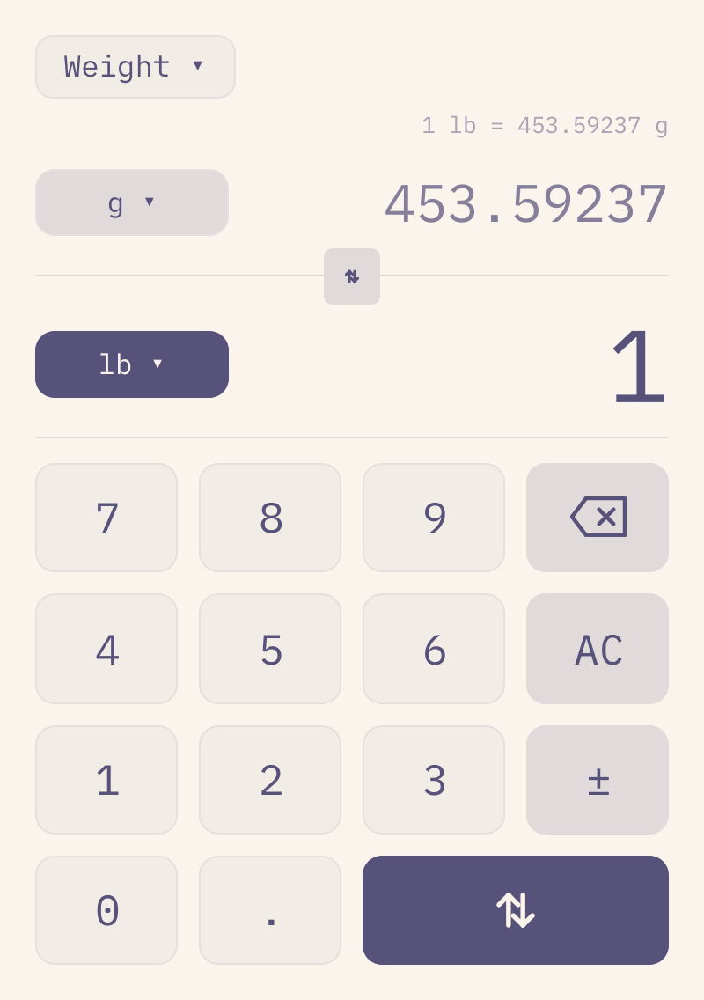
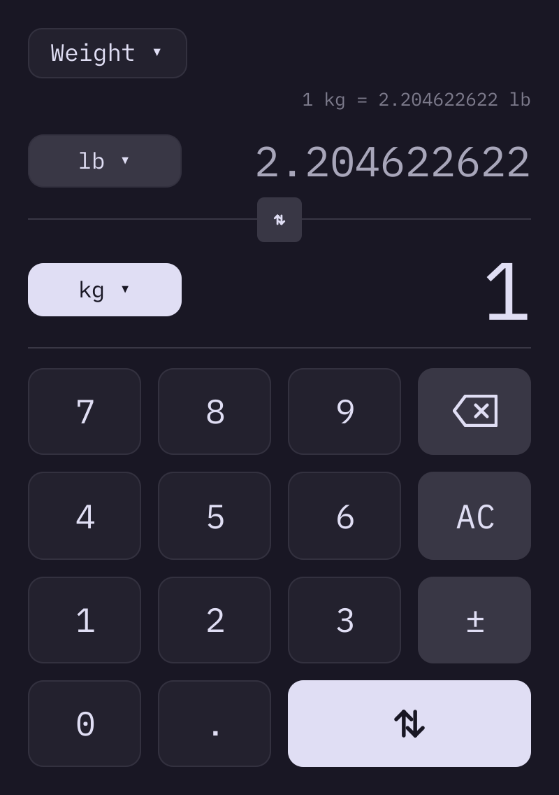
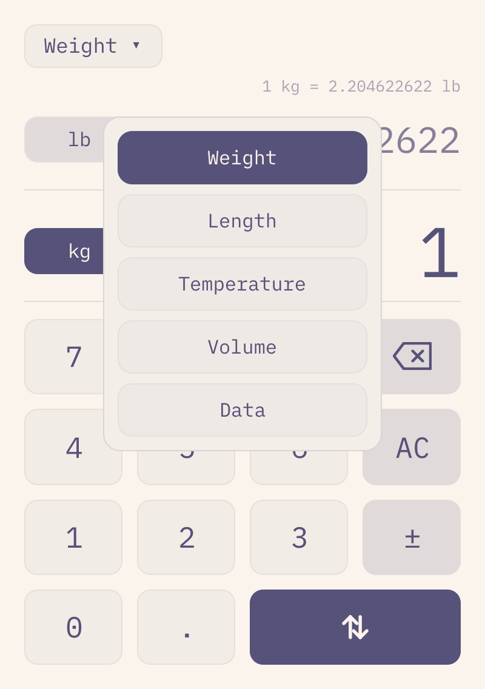
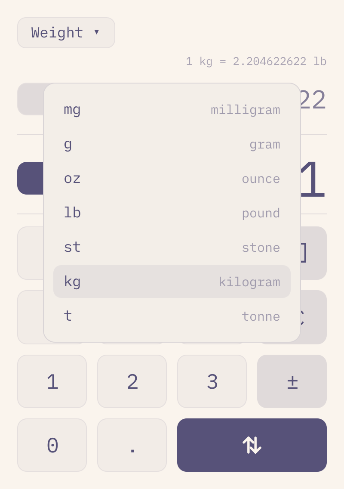

# Omaconvert

A dead-simple unit converter built with Qt Quick and C++ that automatically
follows the Omarchy theme and system dark/light mode — Omacalc's sibling.

  
  

| Picking a category | Picking a unit |
|---|---|
|  |  |

## Install

Build from source with `bin/build` (requires `qt6-base` and
`qt6-declarative`), or install via the Omarchy Package Repository with the
`omaconvert` package.

## Usage

Type a number; the conversion happens as you type. The number you are
typing is the large row at the bottom, next to the keypad; the converted
result shows above it. There is no equals key — the inverted bottom-right
key is **swap**, and a visible swap button rides the seam between the two
rows.

Categories: weight, length, temperature, volume, and data. Unit symbols are
universal (kg, lb, kB), so they are never translated; the interface follows
the system language for the category picker.

Everything works from the keyboard and the mouse:

- `0-9`, `.`, `,` enter the number; `Backspace` deletes; `C`/`Esc` clears.
- `S` or `-` toggles the sign; `X` swaps the two units.
- `←`/`→` cycle categories; `Ctrl+1…5` jumps straight to one.
- `↑`/`↓` cycle the focused unit (the inverted chip); `Shift+↑/↓` cycles the
  other side; `Tab`/`Shift+Tab` moves the focus mark.
- `Space` opens the focused side's unit picker, `Shift+Space` the other side.
- In the picker: type to filter — `gi` + `Enter` reaches GiB — arrows move,
  `Enter` or `=` commits, `Esc` cancels. Every row is clickable.
- Clicking a value row opens that side's picker; clicking `‹ category ›`
  opens a grid of the five categories.
- `Enter` or `=` copies the result; `Ctrl+Shift+C` copies
  `72.5 kg = 159.835… lb`.
- `Ctrl+V`/`Super+V` pastes a number; `Ctrl+Q` quits.

The interface language follows the system locale (the one Omarchy sets at
install time). Translations live as JSON dictionaries in `i18n/` — add a
file to add a language. Numbers themselves stay dot-decimal, like Omacalc,
and accessibility labels are English for now.

Colors follow the current Omarchy theme
(`~/.local/state/omarchy/current/theme/colors.toml`) and re-tint live when
the theme changes. Text follows the desktop text size —
`omarchy display text size`, or GNOME's `text-scaling-factor`.

## Requirements

- Qt 6: `qt6-base`, `qt6-declarative`
- `xdg-desktop-portal` and a portal backend

The app icon (`icons/omaconvert.svg`) and launcher entry
(`packaging/omaconvert.desktop`) install into the hicolor icon theme and
XDG applications directory when packaged; for a source checkout, copy them
to `~/.local/share/icons/hicolor/scalable/apps/` and
`~/.local/share/applications/`. The icon derives from omacalc's design.

The iA Writer Mono font is bundled under the SIL Open Font License 1.1; see
`fonts/OFL.txt`. The font is copyright Information Architects Inc. and based
on IBM Plex, copyright IBM Corp.
